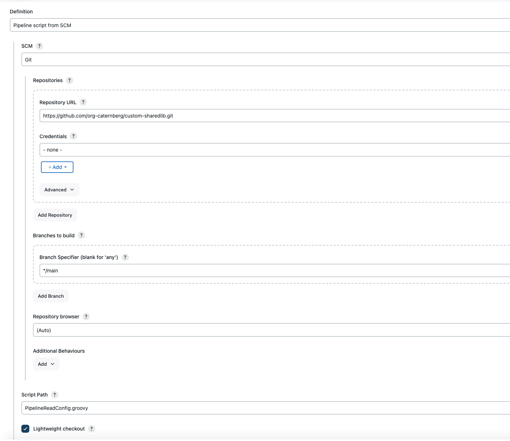
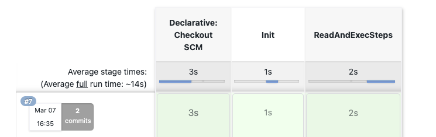

# Current State and Objectives

This repo shows samples for reading properties from a yaml properties files.

The objectives is that Developers can bring their own steps/or properties with Yaml config (read from branch)

# How to start

* Create a Pipeline job, use Pipeline from SCM (this repo)
* Jenkins file path is 'PipelineReadConfig.groovy'

# Steps

sh steps and shell scripts/steps
* When to use shell: https://google.github.io/styleguide/shellguide.html#s1.2-when-to-use-shell
* Bash settings: http://redsymbol.net/articles/unofficial-bash-strict-mode/
* Shell exit codes https://www.cyberciti.biz/faq/bash-get-exit-code-of-command/

We have implemented and discussed several approaches on how to use Pipeline shell steps in a proper way:
See the file  in `vars` directory.

# Shared Libraries

To avoid "script approvals" we must define Shared Libraries on the Jenkins "Global" level.
Libraries on the Folder Level might require approvals. Even when approval is required, we should look for a better alternative
(F.e The dependency to `JSonSlurper` can be removed by using `jq`, see sample in `vars` dir)

# Next Steps

* Review of additional certain steps: what can be externalized or optimized?
* Review and redesign/refactor more SharedLib step code. Identify steps for the common library and identify what team is specific.
* What should be in /src? What should be in /vars? When to use Groovy and when to use Shell?
* POC: implement/migrate an existing Pipeline Job with the "new Design"
* Can we avoid script approvals when even when shared lib on folder level? How?
* Redesign of stages: Better naming and grouping (like init -> build -> test -> qa -> deploy). The current stage areas are confusing
